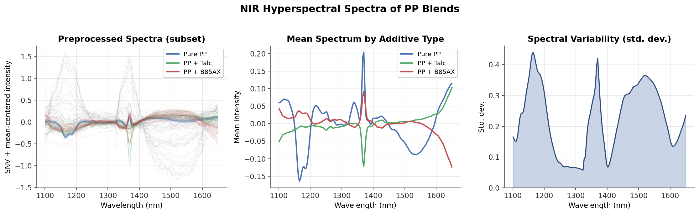
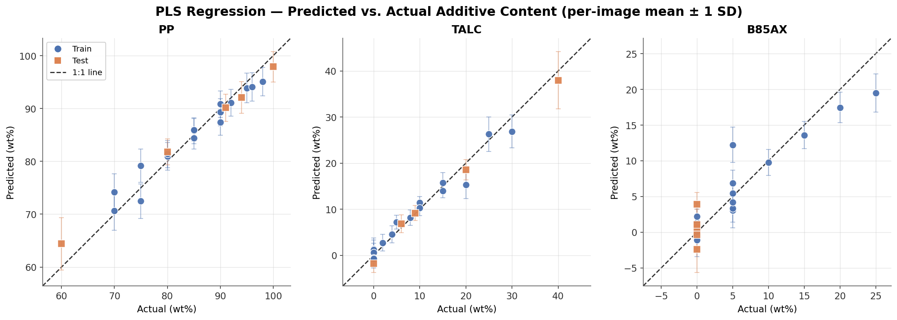
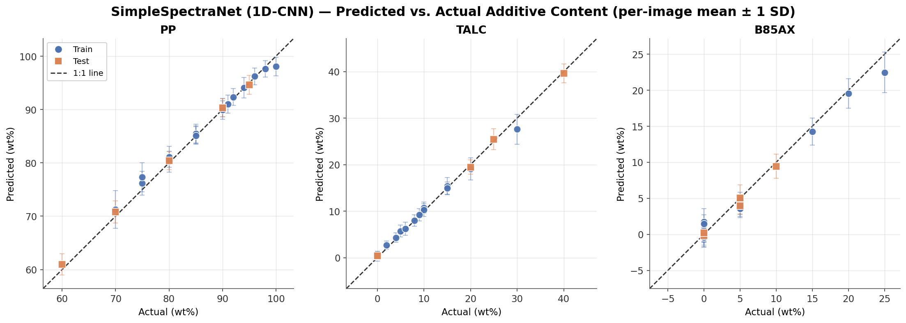

# Hyperspectral Imaging for Plastic Sorting — Project Showcase

**Quantifying additives in polypropylene blends from near-infrared hyperspectral
imaging**, comparing optimised chemometrics (PLS) against a lightweight deep
learning model — built for in-line plastic-recycling applications.

Research internship at the **Singapore Institute of Manufacturing Technology
(SIMTech), A\*STAR**.

> **About this repository.** This is a public *showcase* of the project — results
> and methodology only. The source code lives in a private repository, and the
> hyperspectral dataset is company-owned and not publicly available. The work fed
> into a manuscript currently under review, and code/data are scheduled for
> release upon its acceptance. See [Access](#access) below.

---

## Problem

Post-consumer plastic waste is a mixture of polymers and additives (fillers,
flame retardants). Additives can compromise recyclate quality or exceed hazardous
thresholds, yet conventional density- and image-based sorting cannot detect them —
they sort on physical appearance, not chemistry.

Near-infrared hyperspectral imaging (900–1700 nm) captures a full spectrum at
every pixel, enabling **chemical** identification and quantification at industrial
line speeds — *if* the spectra are correctly preprocessed and modelled.

**System studied:** polypropylene (PP) blended with **talc** (filler) and **B85AX**
(a phosphorus-based flame retardant), across 21 controlled compositions.

## Approach

A three-stage study:

1. **Preprocessing study** — systematically compared scatter correction (SNV/MSC),
   baseline correction (ALS/polynomial), Savitzky–Golay derivatives and
   normalisation on benchtop FTIR and NIR spectra, selecting the pipeline that
   maximised PLS regression performance.
2. **Applied the winning pipeline to hyperspectral data** and built a **PLS
   regression** model to quantify additive wt%. Sample regions were isolated using
   Meta AI's Segment Anything Model (SAM) before per-pixel spectra extraction.
3. **Benchmarked a lightweight 1D-CNN** (*SimpleSpectraNet*) against PLS on the
   same data, to test whether a simple deep model could beat optimised
   chemometrics.

Evaluation used **image-level train/test splitting** (all pixels from an image go
to a single split) to prevent data leakage inflating the metrics.

## Results

**Spectral characteristics after preprocessing**



**PLS regression — predicted vs. actual additive content**



**SimpleSpectraNet (1D-CNN) — predicted vs. actual**



Both plots share identical axes, so the two models are directly comparable. The
CNN tracks the 1:1 line far more tightly — most visibly for the B85AX flame
retardant, where PLS breaks down.

### Test-set performance

| Component | PLS R² | SimpleSpectraNet R² |
|-----------|:------:|:-------------------:|
| PP        | 0.919  | **0.998**           |
| Talc      | 0.939  | —                   |
| B85AX     | 0.000* | —                   |

\* PLS failed to generalise for the flame retardant on the test set — traced to
spectral collinearity between talc and B85AX in the fingerprint region, plus too
few distinct binary B85AX compositions to constrain the model. The CNN handled the
same component robustly.

**Key finding:** a simple 1D-CNN matched or exceeded carefully optimised PLS
chemometrics for additive quantification, and was substantially more robust for
the low-signal flame-retardant component — where the linear model failed outright.

**Honest limitations:** additive dispersion within the polymer matrix is imperfect
despite double extrusion, so nominal compositions carry real spatial variability
(visible as the error bars above). The test set is also small — 5 held-out images
across 21 compositions.

## What was built

```
├── notebooks/
│   ├── 01_sam_segmentation      SAM masking of sample vs. background
│   ├── 02_spectra_extraction    flat-field correction + masking → pixel-spectra dataset
│   ├── 03_pls_modelling         PLS regression + latent-component optimisation
│   ├── 04_cnn_spectranet        SimpleSpectraNet (1D-CNN) training & evaluation
│   └── 05_spectra_plotting      spectra / figure generation
├── preprocessing_study/         FTIR + NIR preprocessing-pipeline comparison
├── scripts/                     mask post-processing, figure generation
└── models/                      trained weights
```

**Stack:** Python · NumPy · scikit-learn (PLS) · TensorFlow/Keras (1D-CNN) ·
PyTorch (SAM) · `spectral` (ENVI hypercubes) · pybaselines · matplotlib

## Access

The full source code is kept in a private repository pending publication of the
associated manuscript. **Reviewers and prospective employers are welcome to
request access** — please reach out and I'm happy to walk through the code.

## Related publication

This internship work fed into a follow-on study that extends the approach — adding
polyethylene, a different flame retardant, scaling to 42 compositions, and adding
an Inception network with multi-label classification:

> Neo, E. R. K.; **Lee, S. H. Y.**; Lau, F. E.; Tan, F. M.; Chan, L. C. Z.;
> Deng, X.; Chng, S. *Deep Learning-Based Hyperspectral Imaging for the
> Identification and Quantification of Multi-Component Polypropylene Blends.*
> (Manuscript under review.)

## Author

**Lee Hui Yu, Sophia** — research internship at SIMTech, A\*STAR
(Nanyang Technological University)

---

*Figures and results © the author. Not licensed for reuse pending publication.*
